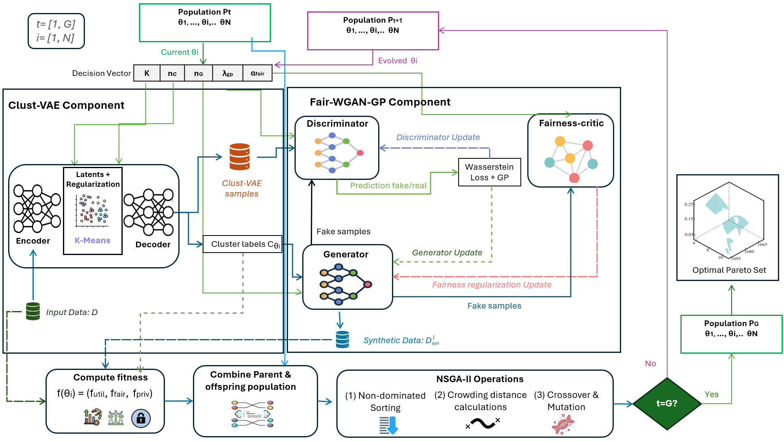

# Evo-Clust-VAE-WGAN-GP

**Exploring utility–fairness–privacy trade-offs in synthetic tabular healthcare data through evolutionary configuration search.**



*Figure 1. Overview of Evo-Clust-VAE-WGAN-GP. Each population member configures the Clust-VAE and Fair-WGAN-GP components. Generated records are evaluated through a three-objective fitness vector, and evolutionary selection produces successive populations and an approximate non-dominated solution set.*


## Objective

**Evo-Clust-VAE-WGAN-GP aims to characterize the utility–fairness–privacy trade-off landscape of synthetic tabular healthcare data by jointly searching structural and training hyperparameters.** The configuration task is formulated as a tri-objective optimization problem across five healthcare benchmarks: **HIV, Stress, Obesity, Heart Failure, and Pediatric**.

The framework uses **NSGA-II as an outer configuration-search layer over the existing Clust-VAE-WGAN-GP generative architecture**. Each candidate specifies a cluster count, training durations, and regularization coefficients. The generative pipeline is trained and evaluated for that configuration, and NSGA-II uses the resulting objective vector to approximate a Pareto front of alternative compromises.

At the methodological level, the contribution concerns **how the generative model is configured**: the outer search invokes the model's training procedure for each candidate without introducing new internal learning rules. The supplied implementation and its reproducibility limitations are documented below; this design description is not a claim that every released training detail has been verified against the original publication.

## Generative architecture and original publication

The generative model selected for this study is **Clust-VAE-WGAN-GP**:

> **Fair and Privacy-Preserving Synthetic Data Generation via Clustering-Based Variational Autoencoder and Adversarially Debiased Wasserstein Generative Adversarial Networks with Gradient Penalty.**

**[Original manuscript — HAL, version 1](https://hal.science/hal-05113907v1/document)** · 

Clust-VAE-WGAN-GP supplies the underlying generative architecture; **Evo-Clust-VAE-WGAN-GP** denotes the present framework that adds evolutionary configuration search around it. The original publication should be cited for the base model, alongside the evolutionary study when its bibliographic record is available.

### Architecture components

| Component | Role in the pipeline |
| --- | --- |
| **Clust-VAE** | Encodes numerical tabular records into a latent representation, incorporates clustering regularization, and reconstructs the records through a decoder. |
| **WGAN-GP generator** | Produces synthetic records from Gaussian noise within an adversarial training stage that uses the VAE reconstructions as reference data. |
| **Wasserstein critic** | Scores reference and generated records; a gradient penalty regulates critic training. |
| **Fairness critic** | Supplies the cluster-based fairness mechanism represented in the architecture. The released code's label usage and gradient flow are discussed under implementation notes. |
| **Objective evaluation** | Measures the configured utility, fairness, and empirical privacy criteria for each candidate's generated data. |
| **NSGA-II outer search** | Evolves configurations using non-dominated sorting, crowding distance, crossover, and mutation to retain alternative objective trade-offs. |


## Research contributions and study design

- **Tri-objective configuration:** Jointly optimize structural and training hyperparameters under utility, fairness, and privacy objectives, retaining a vector of outcomes for each candidate.
- **Evolutionary configuration of an existing model:** Apply NSGA-II around Clust-VAE-WGAN-GP to approximate Pareto fronts while keeping the underlying training procedure as the inner evaluation process.
- **Landscape characterization:** Use scalarized SA and BO as diagnostic probes of the regions exposed by single-point configuration search. Their role is to help interpret the trade-off landscape rather than establish a universal optimizer ranking.
- **Structural and regularization interactions:** Investigate how jointly varying the cluster count `K`, regularization coefficients, and training epochs reveals operating regimes that may be missed when structural parameters are fixed.

The accompanying study reports strongly dataset-dependent trade-off geometries, including continuous and fragmented fronts, and comparatively concentrated operating regions for its scalarized probes. These are findings reported in the manuscript; readers should consult its experiments for supporting evidence. They do not imply that every scalarized strategy must fail: multiple weights or other scalarizations can expose additional compromises.

The fixed-K experiment complements this analysis by evaluating predefined cluster counts over a regularization grid. Together, these experiments examine which parts of the attainable landscape are exposed under the studied configuration strategies and budgets.

> **Release scope:** The four supplied scripts are configured for **Stress**. Dataset files, metric/accountant helper modules, and the evolutionary study's final bibliographic record must be supplied separately. The setup below uses proposed descriptive script names. See **Implementation and reproducibility notes** before interpreting or comparing results.

### Network configuration

Let `d` denote the number of preprocessed input features and `z` the VAE latent dimension.

| Component | Configuration in the search scripts |
| --- | --- |
| VAE encoder | `d → 512 → 256 → 2z`; output split into mean and log variance |
| VAE decoder | `z → 256 → 512 → d`; sigmoid output |
| VAE latent dimension | `z = 20` |
| VAE hidden layers | Batch normalization, LeakyReLU with slope `0.2`, dropout `0.3` |
| VAE loss | Reconstruction MSE + `0.5 × KL` + `0.01 × clustering loss` |
| Generator | `d → 128 → 256 → 128 → d`; batch normalization, ReLU, sigmoid output |
| Wasserstein critic | `d → 256 → 128 → 1`; batch normalization and LeakyReLU |
| Fairness critic | Padded cluster encoding → `128 → 64 → n_sensitive_attrs`; ReLU |
| Candidate VAE training | Adam, learning rate `1e-3` |
| Candidate WGAN/critic training | Adam, learning rate `1e-4` |
| Training batch size | `64`, with incomplete batches dropped |

These values describe the active candidate-training functions in NSGA-II, BO, and SA. Separate top-level optimizer declarations are not necessarily used during candidate evaluation.

## Search strategies and hyperparameters

The searched configuration is `theta = (K, lambda_gp, alpha_fair, n_C, n_G)`.

| Parameter | Meaning | Search range |
| --- | --- | --- |
| `K` | Number of clusters | 5–20; converted to integer for training |
| `lambda_gp` | Gradient-penalty coefficient | 1.0–20.0 |
| `alpha_fair` | Generator fairness-term coefficient | 0.01–1.0 |
| `n_C` | Clust-VAE training epochs | 5–30; integer |
| `n_G` | WGAN training epochs | 5–30; integer |

| Experiment | Implementation | Settings in the supplied script |
| --- | --- | --- |
| NSGA-II | `pymoo.algorithms.moo.nsga2.NSGA2` | 30 seeds; population 4; termination at 12 evaluations per run |
| BO | Optuna `TPESampler` | 30 seeds; 80 trials per seed, followed by a fresh evaluation of the selected configuration |
| SA | Custom annealing routine | 30 seeds; 80 iterations, plus initialization and a fresh final evaluation; initial temperature 1.0; cooling factor 0.99 |
| Fixed-K | Predefined parameter grid | `K ∈ {5, 8, 10, 12, 15}`; `lambda_gp ∈ {1, 5, 10}`; `alpha_fair ∈ {0.05, 0.1, 0.2}`; `n_C = n_G = 10` |

BO uses a **Tree-structured Parzen Estimator**, as specified by [Optuna's TPESampler documentation](https://optuna.readthedocs.io/en/stable/reference/samplers/generated/optuna.samplers.TPESampler.html). The fixed-K grid contains 45 configurations and the script additionally performs an initial 50-epoch VAE training stage.

BO and SA minimize `J(theta) = f_utility + f_fairness + f_privacy`, using weights `(1, 1, 1)`. Their `objective_norm` field is computed after the runs; it is not per-component normalization during search. Equal coefficients therefore do not imply equal influence when objective scales differ.

### Objective definitions in this code version

| Script | Utility objective | Fairness-labelled objective | Privacy objective |
| --- | --- | --- | --- |
| NSGA-II | MMD + mean DWP − alpha precision − beta recall | `1 − silhouette + Davies–Bouldin` | Epsilon-identifiability + mean NNDR |
| BO / SA | Same composite utility as NSGA-II | Cluster statistical parity + Davies–Bouldin − silhouette | Epsilon-identifiability + mean NNDR |
| Fixed-K | MMD | Cluster statistical parity | NNDR |

`DWP` denotes the return value of `compute_dimensionwise_probability`; `NNDR` denotes the return value of `compute_nndr`. Their exact definitions and direction must be checked in `Evaluation_metrics.py`. Alpha precision and beta recall use `alpha=0.5` and `beta=0.5`.

NSGA-II, BO, and SA pass these values to minimization routines. The NSGA-II fairness-labelled objective measures clustering structure, **not demographic parity**. The four scripts do not currently share an identical evaluation protocol; harmonize metrics and sampling before placing their results in a common objective space.

## Repository organization

Use the following proposed paths. Rename the supplied scripts according to this mapping before using the execution commands.


| Path | Contents |
| --- | --- |
| `README.md` | Project description and usage instructions |
| `NSGA_II.py`, `SA.py`, `BO.py`, `Fixed_K.py` | Standalone experiment scripts |
| `Evaluation_metrics.py` | Required custom metric functions; supply the original module |
| `zcdp_accountant.py` | Required custom privacy-accounting functions; supply the original module |
| `requirements.txt` | Direct dependencies listed below; pin validated versions for the release |
| `Dataset_Stress/` | Stress input CSV files |
| `Dataset_HIV/`, `Dataset_Obesity/`, `Dataset_Heart_Failure/`, `Dataset_Pediatric/` | Proposed folders for the other manuscript benchmarks |
| `figures/architecture.png` | Supplied evolutionary architecture figure; displayed near the beginning of this README |
| `results/<dataset>/<method>/` | Suggested archive location for experiment outputs |

The scripts currently write to the working directory or dataset directory, rather than automatically using `results/`.

## Requirements and installation

The direct third-party imports require the following packages. Use these lines as the initial contents of `requirements.txt`:

```text
numpy
pandas
torch
scikit-learn
matplotlib
pymoo
optuna
```

```bash
python -m pip install -r requirements.txt
```

The original Python version and dependency versions were not included with the scripts. This list is not a validated environment lock. The two custom helper modules may introduce additional dependencies.

From the repository root, create an isolated environment:


```bash
python -m venv .venv
```

Activate it in Windows PowerShell:

```powershell
.\.venv\Scripts\Activate.ps1
```

Or in Linux/macOS:

```bash
source .venv/bin/activate
```

Then install the dependencies after creating `requirements.txt`:

```bash
python -m pip install -r requirements.txt
```

The scripts select CUDA when available and otherwise use CPU. Check the selected environment with:

```bash
python -c "import torch; print('PyTorch:', torch.__version__); print('CUDA:', torch.cuda.is_available())"
```

Place `Evaluation_metrics.py` and `zcdp_accountant.py` alongside the scripts. Without these files, imports fail. Their filenames are case-sensitive on Linux.

## Data requirements and organization

### Stress example

Place these files in `Dataset_Stress/`:

| Filename | Usage |
| --- | --- |
| `corporate_stress_dataset_preprocessed.csv` | Numerical feature matrix used for training and evaluation by all four scripts |
| `corporate_stress_dataset.csv` | Original table read by NSGA-II, BO, and SA to count numerical and categorical columns |

The preprocessed CSV must have a header and values convertible to `float32`. Remove exported index columns; encode categorical variables and handle missing/non-finite values before training. Since the decoder and generator use sigmoid outputs, document preprocessing that represents generated features in `[0, 1]`, together with inverse transformations.

The current Stress configuration expects these exact column names:

```python
['Age', 'Gender_Male', 'Gender_Non-Binary']
```

Retain the same feature order throughout training, generation, and reconstruction. Record the protected-attribute definitions and encodings explicitly. Preserve row alignment when attaching protected attributes to records.

### Other manuscript benchmarks

| Benchmark | Proposed folder | Information needed for reproduction |
| --- | --- | --- |
| HIV | `Dataset_HIV/` | Exact dataset citation/version, CSV filenames, preprocessing, protected attributes |
| Stress | `Dataset_Stress/` | Source citation/version and preprocessing procedure for the filenames above |
| Obesity | `Dataset_Obesity/` | Exact dataset citation/version, CSV filenames, preprocessing, protected attributes |
| Heart Failure | `Dataset_Heart_Failure/` | Exact dataset citation/version, CSV filenames, preprocessing, protected attributes |
| Pediatric | `Dataset_Pediatric/` | Exact dataset citation/version, CSV filenames, preprocessing, protected attributes |

The supplied scripts do not identify authoritative download links for these five datasets. Add the exact sources, access conditions, sample/feature counts, and train/validation/test protocol used for the article. The current scripts read the preprocessed table directly; they do not establish an independent held-out evaluation split.

## Configuration and execution

### 1. Set the dataset location

In each script, replace the machine-specific `dataset_directory` with the folder containing the CSV files. If running from the repository root:

```python
dataset_directory = './Dataset_[Dataset_name]/'
```

Keep the trailing slash because filenames are concatenated with this string. For another benchmark, update every CSV read, protected-attribute selection, output filename, and dataset metadata field.

### 2. Check experiment settings

Set `N_RUNS`, `POP_SIZE`, and `N_EVALS` for NSGA-II; `N_SEEDS` and `EVAL_BUDGET` for BO/SA; and `K_values`, `lambda_gp_grid`, and `alpha_fair_grid` for fixed-K. These are source-code settings: the scripts do not provide a command-line argument interface.

For an initial smoke run, reduce the number of runs and candidate evaluations. Restore the documented publication settings for a reproduction experiment. The supplied NSGA-II budget is explicitly reduced and differs from BO/SA.

### 3. Run the selected experiment

After supplying the helper modules and data, and addressing the implementation notes below, execute from the repository root:

```bash
python NSGA_II.py
```

```bash
python BO.py
```

```bash
python SA.py
```

```bash
python Fixed_K.py
```

Each command launches its own training experiment. The `# %%` markers also allow cell-by-cell use in a compatible Python editor. Top-level data loading and model setup run even when the files are imported; fixed-K also performs preliminary training before its main block.

### 4. Locate the outputs

| Experiment | Files written by the supplied script |
| --- | --- |
| NSGA-II | `NSGAII_front_seed_<seed>.npy`; `NSGAII_30runs_summary.csv` in the working directory |
| BO | `BO_results_Dx.json` in the working directory |
| SA | `SA_results_Dx.json` in the working directory |
| Fixed-K | `fixed_k_baseline_results.json` in `dataset_directory` |

NSGA-II also prints hypervolume statistics using normalization shared across its runs. Its saved `.npy` files contain objective vectors; corresponding configuration vectors remain in memory as `res.X` and should also be exported for a reproducible release. BO/SA JSON files include selected configurations, objective components, and histories. BO/SA re-train for the final component evaluation, so those components may not sum to the previously selected best scalar score.

Synthetic records are generated during evaluation but are not automatically exported as CSV files. Model-saving helpers in the search scripts must be called explicitly to persist trained weights. Archive results before rerunning because existing output filenames are reused.

## Implementation and reproducibility notes

These notes describe the supplied code version and should be updated when the implementation is revised.

- **Evaluation comparability:** NSGA-II evaluates a full-size synthetic set; BO/SA generate 80 records per evaluation; fixed-K generates at most 500. Fairness and utility definitions also differ as shown above.
- **Fairness training:** The NSGA-II/BO/SA critic loss uses entropy without the protected labels, and K-means receives detached arrays. Consequently, the depicted fairness route does not propagate a gradient back through clustering to the generator. Protected-attribute alignment and the critic output dimension also require review before claiming demographic fairness enforcement.
- **Fairness evaluation:** BO/SA assign real protected attributes to synthetic rows by position and flatten the attribute array. Fixed-K uses real cluster labels in its fairness evaluation. These associations require correction or a justified evaluation design.
- **Privacy interpretation:** Custom zCDP code is present, but the candidate-training routines use ordinary Adam. The printed accountant output does not establish an end-to-end differential-privacy guarantee for these search experiments. Empirical privacy scores and a formal privacy budget are different quantities.
- **Fixed-K reporting:** Its report metadata currently labels the dataset `HIV` despite loading Stress. Metric failures can silently return `1.0`; these fallback values must be distinguished from valid measurements.
- **SA behavior:** Acceptance is calculated against the best-so-far score rather than the current state's score. Document this variant or revise it before describing the routine as standard simulated annealing.
- **Latent centroids:** VAE centroids are registered buffers initialized randomly; the candidate-training function does not update them as learnable parameters or refit them.

A reproducible release should preserve the exact dataset version, preprocessing, objective definitions, actual evaluation counts, seeds, hardware/software environment, and configuration vectors. End-to-end execution has not been verified from the four scripts alone because the datasets and custom helper modules were not supplied.

## Publications and citation

### Original generative model: Clust-VAE-WGAN-GP

Malek Adouani and Zaineb Chelly Dagdia (2025). **Fair and Privacy-Preserving Synthetic Data Generation via Clustering-Based Variational Autoencoder and Adversarially Debiased Wasserstein Generative Adversarial Networks with Gradient Penalty.** In *Machine Learning and Knowledge Discovery in Databases. Research Track*, ECML PKDD 2025, pp. 195–212.

**[HAL manuscript, version 1](https://hal.science/hal-05113907v1/document)** · **[Published chapter and citation](https://doi.org/10.1007/978-3-032-05962-8_12)**

### Evolutionary configuration study: Evo-Clust-VAE-WGAN-GP

This repository documents the tri-objective configuration and landscape-characterization study built around the original generative model.

**Publication record:** Add the evolutionary study's final title, full author list, venue, year, DOI, and public manuscript link when available. The base-model publication above is a separate work.

Please cite the original model when using Clust-VAE-WGAN-GP and cite the evolutionary study when using its configuration-search framework or experimental protocol.

## Acknowledgements

This work is supported by the European Union’s Horizon Europe Programme under the Marie Skłodowska-Curie Actions, Grant No. 101236749 (https://thunder-msca-se.univ-lille.fr/), the France 2030 programme (ANR-18-RHUS-0004; ANR-23-IAHU-0004), the iRECORDS project (JTC_2021), and the French Programme Investissement d’Avenir (I-SITE ULNE ANR-16-IDEX-0004; ARCHIE-INFINITE n°I-KUL-22-005), as well as Inserm and the French Ministry of Health (MESSIDORE 2023, IReSP AAP-2023-MSDR-341423).
